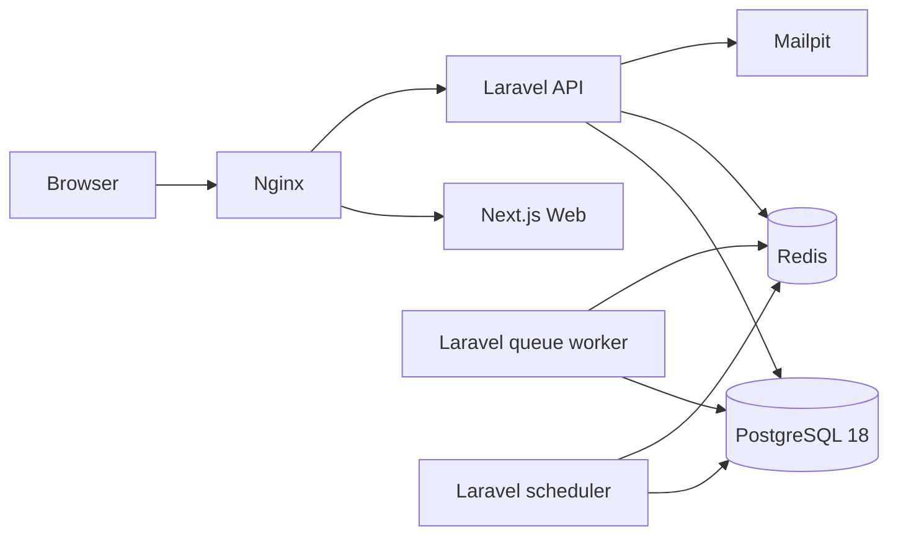
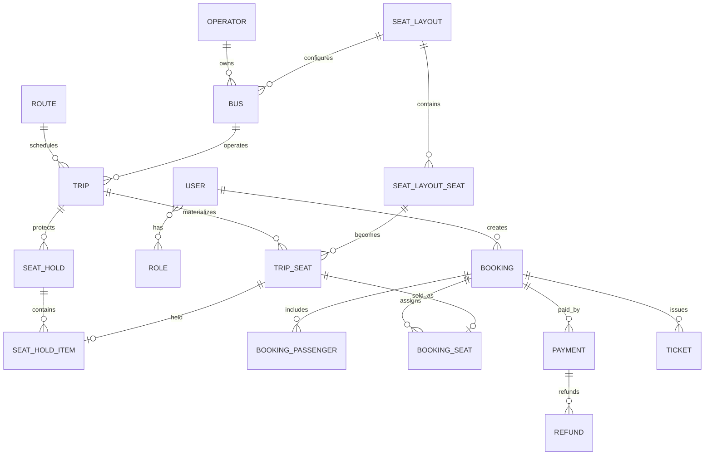

# TripSync architecture

## Runtime topology

The browser sees one origin. Nginx routes `/api/*` to Laravel and customer/admin pages to Next.js. Browser authentication uses Laravel session cookies and CSRF protection rather than localStorage JWTs.

## Core domain

## Booking invariants

- Search reads dated `trips`, never the legacy booking counter table.
- Every trip has one `trip_seats` row per physical layout seat.
- Seat hold creation locks selected rows in deterministic ID order with PostgreSQL `FOR UPDATE` semantics.
- Client-supplied seat counts/fare totals are never authoritative.
- Holds expire server-side and the scheduler releases them.
- A booking is created only from a hold owned by the authenticated user.
- Payment confirmation re-locks the booking, hold and seats before changing state.
- Ticket creation is idempotent through database uniqueness plus `firstOrCreate` behavior.
- Cancellation and seat release occur in one transaction.

## Application boundaries

Laravel controllers coordinate HTTP only. Validation lives in Form Requests; use-case orchestration lives under `app/Application`; reusable rules live under `app/Domain`; payment providers live behind `PaymentGateway`; operational logging lives in `AuditLogger`.

The architecture stays a modular monolith deliberately. The product does not benefit from microservice operational cost at this scale.

## V1.1 discovery and analytics layer

TripSync V1.1 extends the core domain without weakening booking consistency. Discovery metadata is additive: operators expose rating/punctuality/brand information, buses expose comfort class and amenities, and public search resources enrich the existing response instead of replacing fields consumed by V1.0.6 clients.

### Discovery flow

`GET /api/v1/discovery/overview` serves bounded, cacheable public aggregates such as popular routes and top operators. `GET /api/v1/trips/fare-calendar` provides a seven-day lowest-fare/availability view. Normal trip search accepts a `passengers` count and only advertises trips whose authoritative available-seat count can fit the group.

TripScore, comparison labels, UI filtering and sorting are deterministic client-side helpers over server-returned trip facts. They never control booking eligibility or price authority.

### Demo-data composition

Development seeding is split deliberately:

- `NovaReferenceSeeder` owns the network/reference layer: locations, operators, seat layouts, buses, routes, dated trips and trip-seat inventory.
- `NovaCommerceSeeder` owns customer/commercial history: demo users, bookings, passenger assignments, payments, tickets, cancellations/refunds and audit activity.

This keeps reference topology understandable while still producing enough coherent history for fare discovery and admin analytics. The seeders are development/demo tooling and are not production data importers.

### Admin intelligence

The admin overview preserves the existing V1 metrics and adds bounded aggregate fields: `revenue_trend`, `top_routes`, `operator_performance`, `booking_statuses` and `system_health`. Aggregates query PostgreSQL, while Redis/queue status is used only for operational health—not booking truth.

### Nova frontend boundaries

The V1.1 UI keeps feature logic in focused components/helpers:

- recent-search persistence is local-browser convenience only;
- fare/filter/TripScore helpers are pure TypeScript;
- adjacent-seat recommendations are advisory only—the backend still decides whether a hold succeeds;
- heavy chart/map dependencies were intentionally avoided in favor of CSS/SVG presentation and small payloads.
